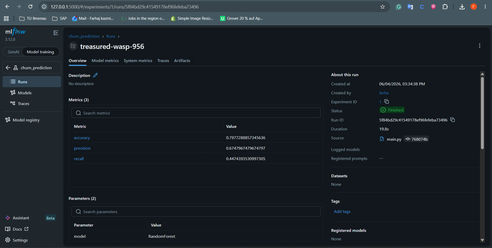
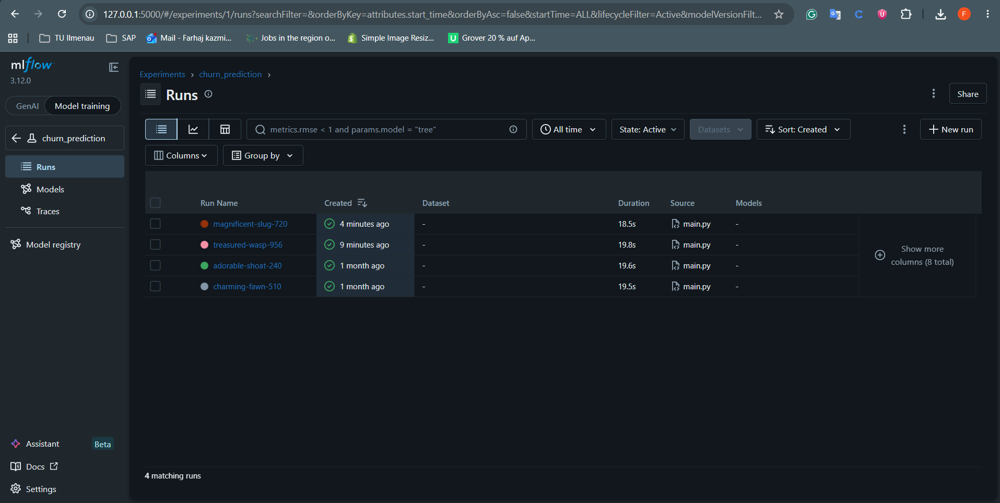
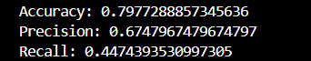

# Churn Prediction ML Pipeline

## Overview

This project demonstrates an end-to-end machine learning pipeline for customer churn prediction using Python, Scikit-learn, and MLflow.

The objective is to identify customers who are likely to churn while building a reproducible workflow for data preprocessing, model training, evaluation, and experiment tracking.

## Technologies Used

* Python
* Pandas
* NumPy
* Scikit-learn
* MLflow
* Git & GitHub
* JupyterLab

## Features

✔ Data preprocessing

✔ Feature engineering

✔ Train/Test split

✔ Random Forest model training

✔ Model evaluation

✔ MLflow experiment tracking

✔ Metric logging

✔ Parameter logging

✔ Reproducible ML pipeline

## Workflow

1. Data Loading
2. Data Cleaning & Preprocessing
3. Feature Engineering
4. Train/Test Split
5. Model Training
6. Model Evaluation
7. Experiment Tracking with MLflow

## Pipeline Architecture

```text
Dataset
   ↓
Data Preprocessing
   ↓
Feature Engineering
   ↓
Train/Test Split
   ↓
Random Forest Training
   ↓
Model Evaluation
   ↓
MLflow Tracking
```

## Model Performance

| Metric    | Score |
| --------- | ----- |
| Accuracy  | 79.8% |
| Precision | 67.5% |
| Recall    | 44.7% |

The model is trained using a Random Forest classifier and tracked using MLflow for experiment management and reproducibility.

## MLflow Experiment Tracking

The project uses MLflow to track:

* Model parameters
* Performance metrics
* Experiment history
* Reproducible training runs

### Run Details



### Experiment Dashboard

The MLflow experiment dashboard allows comparison of multiple runs and model configurations.



## Pipeline Execution

Run the complete pipeline using:

```bash
python main.py
```

### Example Output



## Key Learnings

* Building reproducible machine learning workflows
* Experiment tracking using MLflow
* Data preprocessing and feature engineering
* Model evaluation and performance comparison
* Version control using Git and GitHub

## Future Improvements

* Hyperparameter tuning
* Docker containerization
* CI/CD integration
* Cloud deployment
* Model monitoring

## Repository Structure

```text
churn-ml-pipeline/
│
├── data/
│   └── churn.csv
│
├── screenshots/
│   ├── mlflow-run.png
│   ├── mlflow-experiments.png
│   └── terminal-output.png
│
├── main.py
├── requirements.txt
├── README.md
└── .gitignore
```

## Author

**Farhaj Kazmi**
Master's Student – Computer and Systems Engineering
TU Ilmenau, Germany
